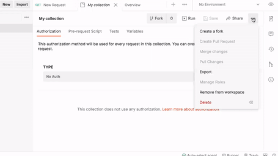
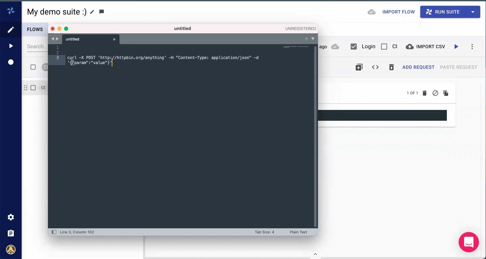
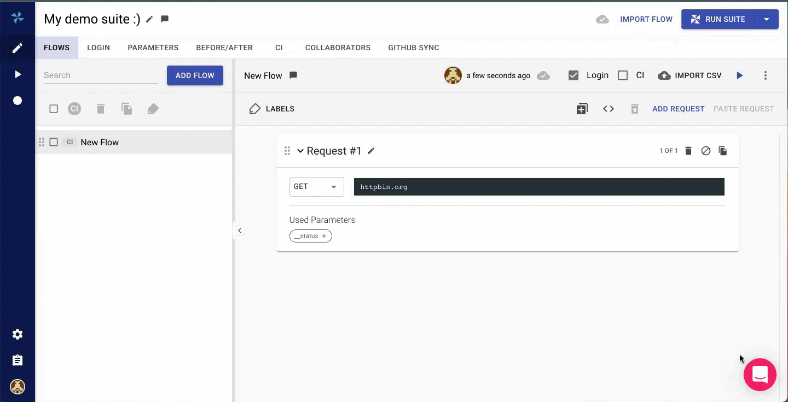

# 🧳 Import & Export

Loadmill users can import Test Suites, Test Flows, CSV files, Requests, Load Tests and Recordings.

### **Importing Test Suites**

Navigate to Test Suites and click IMPORT SUITE. Make sure your Test Suite in the JSON file format.

.png>)

For example, you can use this option to import a collection from Postman. First, export the collection by clicking on three dots within the collection and choosing Collection v2.1 (recommended).

Then, go to Loadmill and import the collection as a Test Suite. Loadmill will automatically recognize Postman data and create a new Test Suite with test flows and parameters.

### Importing Test Flows and CSV files

To import a test flow, enter a specific Test Suite and click IMPORT FLOW. Loadmill allows to import test flows in the HAR and JSON file formats.

.png>)

You can also use this option to import [HAR files](https://en.wikipedia.org/wiki/HAR\_\(file\_format\)) generated by the browser's Dev Tools or [Charles proxy](https://www.charlesproxy.com).

Once it's done, you may want to run this or another test flow several times using different parameter values for each run. To achieve that, create a CSV file containing relevant parameters and their values and import it by clicking on IMPORT CSV within the test flow. Find more information on that [here](https://docs.loadmill.com/api-testing/test-suite-editor/api-tests-data-from-csv-files).

### Importing Requests

You can easily paste a cURL command as a request to Loadmill.


:brain: Make sure you have given permissions to your browser to copy and paste text and images to [the clipboard](https://docs.loadmill.com/general-troubleshooting#it-seems-like-i-cant-paste-requests-within-a-flow).


### Importing Load Tests and CSV files

Navigate to Load Tests and click IMPORT TEST. Loadmill allows to import load tests in the HAR and JSON file formats.

.png>)

You can also import CSV files into load tests, see how to do that [here](https://docs.loadmill.com/load-testing/working-with-the-test-editor/data-from-csv-files).

### Importing Recordings

In case you are using [GoReplay](https://goreplay.org) and would like Loadmill to generate an API Test Suite from it, you can import Gor file on the Recordings page by clicking IMPORT RECORDING.

.png>)

Once it's done, you can click on the GENERATE TEST SUITE button within the recording so that a new Test Suite will be created and contain all data from the Gor file.

### Exporting data

You can export Test Suites, Test Flows, Load Tests, Test Suite/Test Plan/Load Test Run CSV Reports and [Usage Reports](https://docs.loadmill.com/account-settings/billing/usage-report) (team admins only).

Let's say you ran a test and one of the requests has failed and now you would like to run it separately in the CLI. To do that, just click **Copy as cURL** within the failed request.

You can use this option in Test Suite and Load Test Runs as well.
