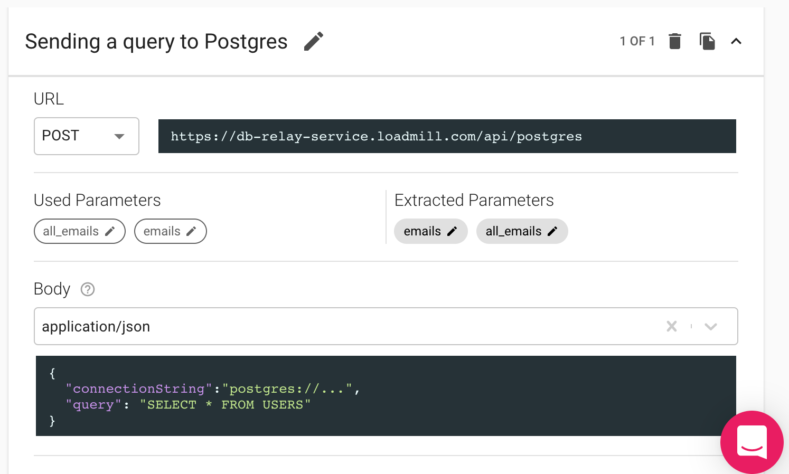

# DB Testing using Queries

Loadmill allows users to execute various queries directly to their DB in order to validate data. This is a very powerful feature as it allows users to check data integrity and accuracy.


## Usage

### Postgres

To execute a query:

1. Go to a relevant test flow within a Test Suite.
2. Select "POST" as request Method, put URL - `https://db-relay-service.loadmill.com/api/postgres`
3. Choose "application/json" as Content-type.
4. Put the request body with the following structure:

```
body: {
  "connectionString": "postgres://...",
  "query": "SELECT * FROM USERS"
}
```

See a request example below:



By running the request, you will get a response in JSON format and be able to operate the data.

### MongoDB

Execute queries directly to MongoDB:

`https://db-relay-service.loadmill.com/api/mongo`

For example: search for a user with the name Moses:

```
body: {
  connectionString: 'mongodb://...',
  collection: 'users',
  command: 'find',
  query: { "name":"Moses" }
}
```

By default, using the this service is meant to be for read only proposes (i.e. find). However, while using the Docker image privately in your system you can use the environment variable `ALLOW_ALTERING=true` by doing so the following options will be available:

* insertOne
* insertMany
* updateOne
* updateMany
* deleteOne
* deleteMany

Examples:

#### InsertOne:

```
body: {
  connectionString: 'mongodb://...',
  collection: 'users',
  command: 'insertOne',
  query: { "name": "Moses", "age": "56" }
}
```

#### updateOne:

```
body: {
  connectionString: 'mongodb://...',
  collection: 'users',
  command: 'updateOne',
  query: { "name":"Moses" },
  update: { "$set": { "age": "67" } }
}
```

#### deleteOne:

```
body: {
  connectionString: 'mongodb://...',
  collection: 'users',
  command: 'deleteOne',
  query: { "name":"Moses" }
}
```

Additional help regarding using update operators can be found [here](https://www.mongodb.com/docs/manual/reference/operator/update).

### Redis

Execute queries directly to Redis:

`https://db-relay-service.loadmill.com/api/redis`

<pre><code><strong>body: {
</strong>  {
    connectionString: "redis://...", 
    command:"get | hget | hgetall",
    key:"any-key",
    field: "any-field"
   }
}</code></pre>

### MySQL&#x20;

Execute queries directly to MySQL 5.7:

`https://db-relay-service.loadmill.com/api/mysql`

```
body: {  
  "connectionString": "mysql://...",
  "query": "SELECT * FROM TASKS"
}
```

## DB relay service static IPs

Sometimes, executing queries to your env DB may require VPN. You can easily avoid this by whitelisting the DB relay service static IPs: \[52.42.51.230, 54.190.108.53] in your firewall.

## Docker image

You can also use a docker image for DB relay service to deploy it in a specific environment of yours, find more information [here](https://hub.docker.com/r/loadmill/db-relay-service).
