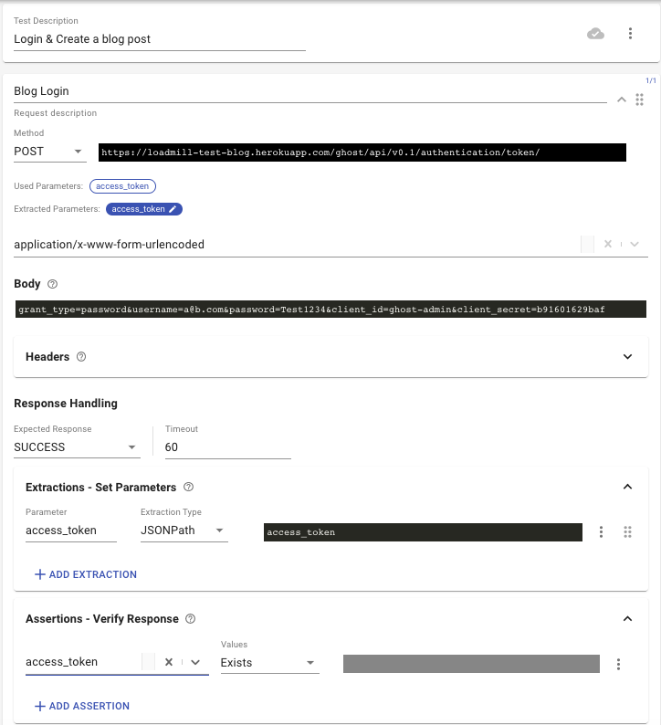

# Creating a parameterized load test

In our [first simple test](https://docs.loadmill.com/load-testing/getting-started#creating-and-running-a-load-test-from-scratch-in-loadmill) we have simulated users loading the homepage of our blog, our second test is going to simulate several users publishing new entries to the blog.

* First create a new empty test. Only logged in users can post to our blog, so let's start by executing a login request and store the authentication token returned by it into a parameter for later use.
* Give your new test a short description `Login & Create a blog post`
* Update the request description to `Blog Login`
* Set the Request #1 method to `POST` and its URL to - `https://loadmill-test-blog.herokuapp.com/ghost/api/v0.1/authentication/token/`
* Click the "ADVANCED" button to expand the advanced section of the request.
* Set the Content-Type to `application/x-www-form-urlencoded` (last in the list).
* And paste this as the request body - `grant_type=password&username=a@b.com&password=Test1234&client_id=ghost-admin&client_secret=b91601629baf`
* Expand the “Extractions - Set Parameters” card and set a value to a parameter named `access_token` using a `JSONPath` extractor querying for `access_token`. This will create a value extractor that will execute a [JSONPath query](http://goessner.net/articles/JsonPath/) against the JSON response of the request and extract the authentication token into a parameter named `access_token`.
* Verify that a value was set to the parameter `access_token` by the `JSONPath` extractor by expanding the ‘Verify Response’ card of the request and creating an assertion. Add an assertion that states that the `access_token` parameter `Is True` (Use the "Exists" assertion type).



* Click **DRY RUN** and execute a trial run to make sure it is working.
*   Now that we have the authentication token stored in `access_token` we can use it to publish on our blog

    * Create a new request by clicking the "+ ADD REQUEST" button below the first request.
    *   Set its description to `Publish Blog Post`

        Set it as a `POST` request to `https://loadmill-test-blog.herokuapp.com/ghost/api/v0.1/posts/`
    * Click on the "ADVANCED" button and set the Content-Type to `application/json` and the body to this JSON-

    ```javascript
    {
       "posts": [
          {
             "title": "Title ${__random_chars}",
             "slug": "${__random_chars}",
             "markdown": "Text ${__random_chars}",
             "status": "published"
          }
       ]
    }
    ```

    * This JSON body defines the blog post that we are going to publish. Notice that we have used one of [Loadmill's functions](https://docs.loadmill.com/api-testing/test-suite-editor/parameters/functions) to make it a little more interesting - `${__random_chars}`. The `__random_chars` parameter will change to 10 random characters during test/trial execution.
    * Now, let's use the `access_token` parameter value we extracted from the login response to authenticate this request. Expand the header card of publish request and add a header with the name `Authorization` and the value `Bearer ${access_token}`
    * Run a trial of the whole scenario and go to `https://loadmill-test-blog.herokuapp.com/` to see that our blog posts are getting published.

Now that we know that our full scenario is working we can run it as a load test. Click the "RUN TEST" button at the bottom of the test and run the test 🎉
