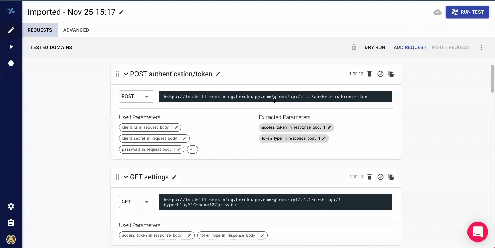

# Quick Parameter Editing

By extracting static values into dynamic parameters, you can easily change URLs, request body, and headers across all requests. This can be very useful when recording a test scenario in one environment, and running it on another.

To extract a string into a parameter, click the `EXTRACT PARAMETER` button at the top of the test editor. Set the parameter name and the value for extraction, and click the **EXTRACT** button (For large tests, this can take a few seconds).

This trick can be also very useful to set authentication and CSRF headers across all requests.
