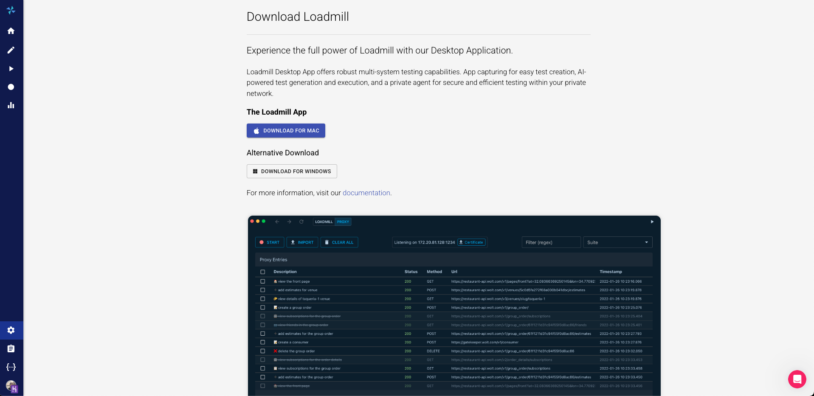

# Loadmill POC Setup

## Step 1: AAA (Access, Authentication, Algorithm) Test

In this step, we will test the Algorithm component. Open your web application in Google Chrome.

Press F12 (or right-click → Inspect) to open the Developer Tools, then navigate to the Network tab.

Ensure the record button (●) is active.

Perform the use case manually, step by step.

Once complete, right-click anywhere in the Network tab and select “Save all as HAR with content.”

Email the saved .har file to us along with the corresponding manual test case.

If you’re unable to email the HAR file, please create a user account at https://app.loadmill.com/app/signup and share the file through the chat box.

## Step 2: IP Whitelisting

If your test environment is not publicly accessible, please whitelist the following Loadmill IP addresses for the POC:

* 52.42.51.230
* 54.190.108.53
* 193.189.107.30

## Step 3: Install Required Agents

Loadmill requires two agents to be installed for the POC:

### 1. Browser Extension (Chrome or Edge)

Used for test creation on web applications.

* [Download Loadmill Test Composer](../quick-guide/download-test-composer/)
* [Learn how to record user behavior](../user-behavior-testing/working-with-the-recorder/)

If you are unable to install the extension from the browser store, manually install it using the link below:

* [Manual Download](https://drive.google.com/file/u/1/d/1pbTjrdvfTwJw2ynG4jUOjHC1vBNie7kT/view?usp=sharing)

#### Manual Installation on Microsoft Edge:

1. Open **Microsoft Edge** and click the **three dots** (⋯) in the top-right corner.
2. Go to **Extensions** → **Manage Extensions**.
3. Enable **Developer Mode** (toggle on the left).
4. Click **Load unpacked** and select the extracted folder from the ZIP file.
5. The **Loadmill Composer** extension will now appear in Edge.

To begin recording:

* Open your target website (e.g., BUPA).
* Right-click anywhere → **Inspect**.
* In the **Developer Tools**, click the “+” icon, find **Loadmill Composer**, and drag it to the left pane.
* You can now start recording user steps directly in Loadmill Composer.

### 2. Loadmill Desktop Agent

The Desktop Agent acts as a Test Runner for web applications and also supports test creation for mobile and desktop applications.

* [Introduction to Deviceless Mobile Testing](introduction/deviceless-mobile-testing/)
* Download links are available [here](https://app.loadmill.com/app/user/settings/desktop-app) or directly [download from GitHub](https://github.com/loadmill/desktop-app)

