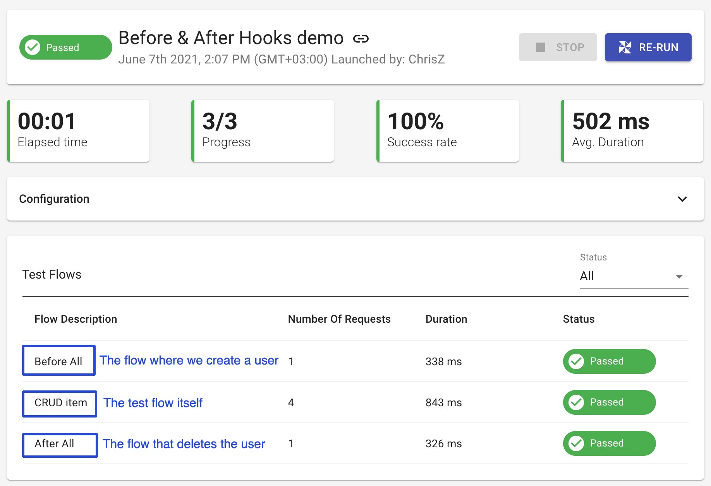
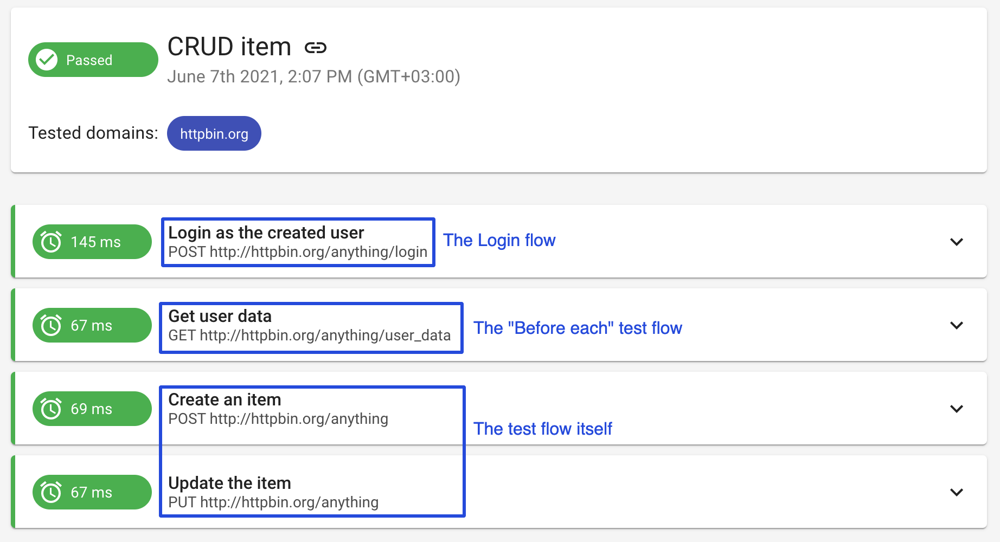

# Before & After Hooks

Often while writing tests, you have some setup work that needs to happen before tests run, and you have some teardown work that needs to happen after tests run. From now on, you can do it and even more by using our before & after hooks.

There are **4 optional hook types** that can be configured:

* Before all test flows
* Before each test flow
* After each test flow
* After all test flows

## How it works

Let's take a simple yet comprehensive example on how to use the hooks. For example, I have a few tests aka test flows in Loadmill that have a shared setup and teardown logic.

First, I need to create a new user and login. Then, my test flow/s should run but it is important to get user data before each test flow. Eventually, I need to delete the user that has been created. Let's configure this logic together.

Navigate to/create a Test Suite containing relevant tests -> BEFORE/AFTER tab. On this page, you can create before & after hooks from scratch or use pre-defined [shared flows](https://docs.loadmill.com/collaboration/shared-flows).

.png>)


:brain: Make sure all test flows residing in the Test Suite are aligned with the Before & After logic. You may configure all hooks or just one depending on your use case.


In our case, we will create the "Before All" flow that will include requests to create a new user. Then, we will use our well-known [Login tab](https://docs.loadmill.com/api-testing/test-suite-editor/global-login-flow) to create a login flow. The "Before Each" flow will include a request to get the user data. After that, our test flow/s run and eventually, we delete the created user within the "After All" flow. Let's run the test flow and see results.

If we enter the test flow itself, we will see our Login and Before Each flows as well.

