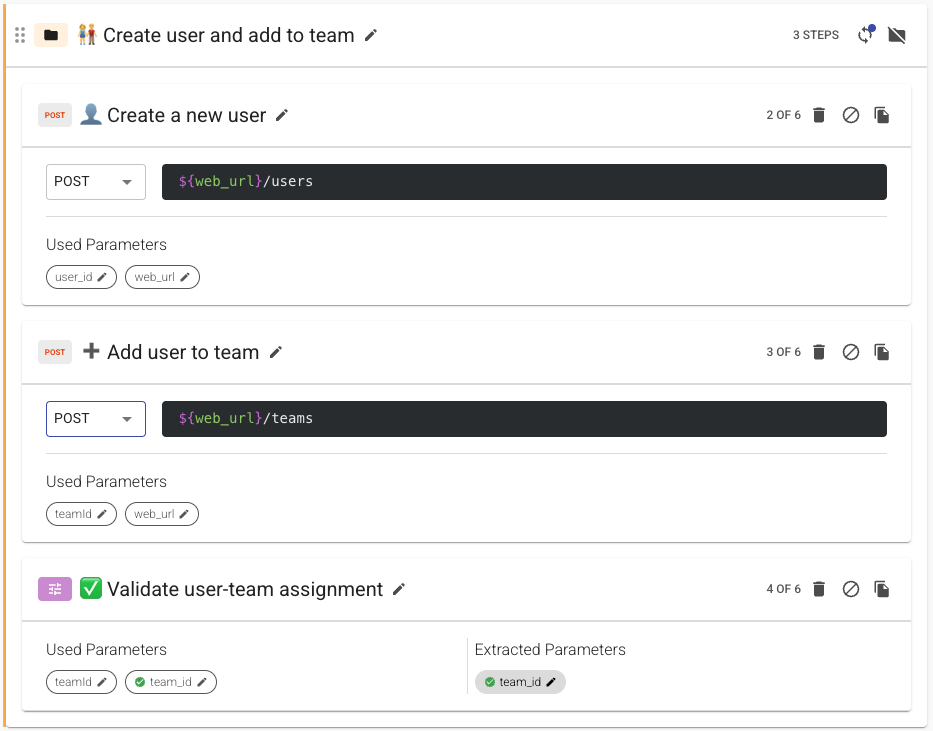
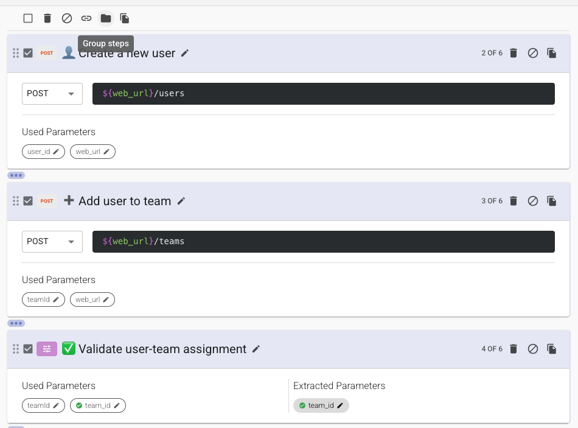
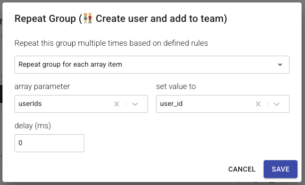
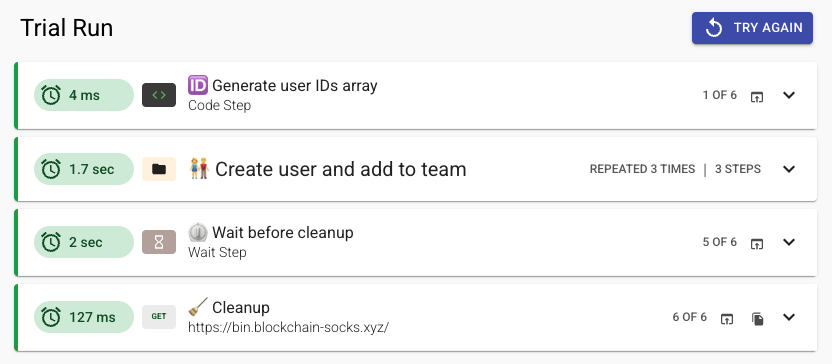

# Groups

A Group lets you bundle multiple steps together under a shared label. This keeps your flow organized and makes it easier to understand at a glance what a set of steps is doing. Groups also unlock features like **Repeat Group**, which lets you run the same set of steps multiple times automatically.



## Creating a Group

To create a group:

1. In the flow editor, select the steps you want to group together using the checkboxes next to each step.
2. Click the **Group** action that appears at the top.
3. Give your group a descriptive name (e.g., "Create user and add to team").

The grouped steps will now appear together under a collapsible section with your description.



## Repeat Group


Repeat Group lets you run the same group of steps once for each item in an array.

### How It Works

When you configure a Repeat Group, you provide:

1. **An 'array parameter'** — an array to iterate over (e.g., a list of user IDs).
2. **A 'set value to' parameter** — the name of the parameter that will hold the current item on each iteration (e.g., `user_id`)

On each iteration, Loadmill takes the next item from the array and assigns it to your chosen parameter. All steps in the group execute with that value before moving on to the next item.

You can also set an optional **delay** (in milliseconds) between iterations if needed.



### Example: Adding Users to a Team

Use Repeat Group when you need to run the same steps (e.g., create user, add to team) once for each item in a list returned by an earlier step.

* You have a parameter `userIds` with the value:

```json
["user_1", "user_2", "user_3"]
```

* In the Repeat Group settings:
  * **Array parameter:** `userIds`
  * **Set value to:** `user_id`
  * **Delay:** `300` ms

**What happens when the flow runs:**

| Iteration | `${user_id}` value |
| --------- | ------------------ |
| 1         | `user_1`           |
| 2         | `user_2`           |
| 3         | `user_3`           |

Each iteration, the group's steps execute using the current `${user_id}` value. For example, if one of the steps sends a POST request to add a user to a team, the request body might look like:

```json
{
  "userId": "${user_id}",
  "teamId": "${team_id}"
}
```

On the first iteration, `${user_id}` will be `user_1`. On the second, `user_2`. And so on until all items in the list have been processed.


