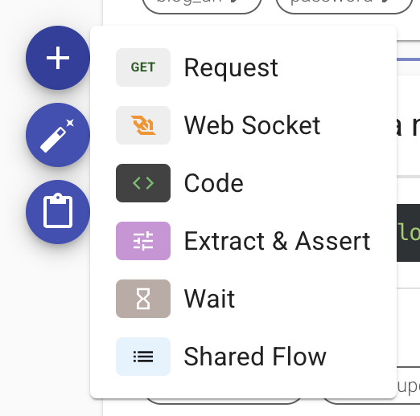

# Steps

Steps are the core components of flows, made up of one or more steps of varying types. They generate, process, and share data. In the code editor, steps can be copied, created, edited, and deleted.

#### Steps views

There are two views in the flow editor.

1.  Summary View: Displays a scrollable area containing all the steps, with each step collapsed to show summarized details.\\

    <figure><figcaption>
Summary view - Collapsed steps example
</figcaption></figure>
2. Expanded view: Displays single steps at a time expanded with all the available functionality.\
   note, some function will require additional expansion.

<figure><figcaption>
Expanded step example
</figcaption></figure>


Navigating between steps in Expended view can be done by keyboard up/down keys and by clicking on the step name on the left index list (when available on wide views).


**Switching between the views** can be dome by clicking on the title area of a step in non active areas as illustrated below

<figure><figcaption></figcaption></figure>

#### Adding a new step

In Summary view,

Click on the dotted menu (.png>)) located in the separation line between any two steps and in the beginning and the end of the flow, depends on where you'd like to introduce the new step.

<figure><figcaption></figcaption></figure>

Select the `+ option`Then click on the desired step type 

A new empty step will be added.

#### Copying step(s)

* To copy a single step click on the copy button (.png>)) located on the top right corner of every Step

<figure><figcaption></figcaption></figure>

To paste the step in the desired place, locate the divider between any two requests or at the beginning or the end of the flow and click on the dotted menu (.png>)) then on the paste button  (3).png>)

* To copy multiple steps, use the checkboxes located left to the description of each step then click on the copy button located at the top.

<figure><figcaption></figcaption></figure>

to paste the copied steps, locate the divider between any two requests or at the beginning or the end of the flow and click on the dotted menu (.png>)) then on the paste button  (3).png>) same as individual flow.


Tip1: To copy all the requests click on the checkbox at the top then use copy/paste as already demonstrated.\
.png>)



On empty flows, this top menu and the dividers will be missing, but you still paste steps by clicking the "paste" label at the top right corner of the screen.png>)

