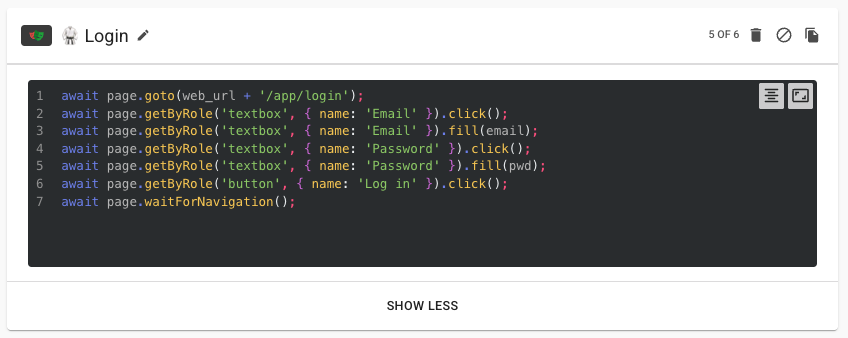

# Playwright step

The **Playwright step** allows you to run UI automation scripts using [Playwright](https://playwright.dev/) as part of your Loadmill flow.

This is especially useful when validating UI behavior alongside your API steps — for example, logging in through the UI, verifying elements on the page, or simulating full end-user workflows.



## Usage

The Playwright step contains a single **code editor** where you write your Playwright script.


> 🧠 Only write the contents of a `test()` block — do **not** include the test declaration itself.

✅ **Correct:**

```ts
await page.goto('https://www.loadmill.com');
await expect(page).toHaveTitle(/Loadmill/);
await page.getByRole('textbox', { name: 'Email' }).fill(email);
```

❌ **Incorrect:**

```ts
test('Login test', async ({ page }) => {
  await page.goto('https://www.loadmill.com');
  await expect(page).toHaveTitle(/Loadmill/);
  await page.getByRole('textbox', { name: 'Email' }).fill(email);
});
```

## Parameters and context

In the Playwright step, **all suite and flow parameters** are available directly as variables — no need to use `${param}` syntax like in other inputs.

✅ **Correct:**

```ts
await page.getByRole('textbox', { name: 'Email' }).fill(email);
```

❌ **Incorrect:**
```ts
await page.getByRole('textbox', { name: 'Email' }).fill(${email});
```

## Cookies

Session cookies are passed automatically into the Playwright browser context, so you can stay authenticated between API and UI steps.

To manually set cookies, you can use Playwright’s built-in [`context.addCookies`](https://playwright.dev/docs/api/class-browsercontext#browser-context-add-cookies) method:

```ts
await context.addCookies([
  {
    name: 'my_cookie',
    value: '12345',
    domain: 'your-app.com',
    path: '/',
    httpOnly: true,
    secure: true,
    sameSite: 'Lax',
  },
]);
```

## Attaching screenshots to the report

You can attach screenshots directly to your test report using Playwright’s `testInfo.attach` method.

✅ Example:

```ts
await page.goto('https://loadmill.com');

const screenshot = await page.screenshot();
testInfo.attach('Loadmill Page', {
  body: screenshot,
  contentType: 'image/png',
});
```

## Requirements

To use Playwright steps, a [private agent](https://docs.loadmill.com/integrations/testing-localhost-application) with UI tests enabled is required.

You can enable UI testing using one of the following options:

- **Desktop App** - UI testing is supported out of the box with no additional configuration required.

- **Docker** - Set the following environment variable when running the container:

  ```bash
  docker run -it --rm -e LOADMILL_AGENT_TOKEN=<your-api-token> -e UI_TESTS_ENABLED=true loadmill/agent
  ```

- **NPM Package** - Run the agent with the `--ui-tests` flag:

  ```bash
  loadmill-agent start -t INSERT_TOKEN_HERE --ui-tests
  ```

  > ⚠️ This option requires additional dependencies and lacks the isolation benefits of Docker or the Desktop app.
