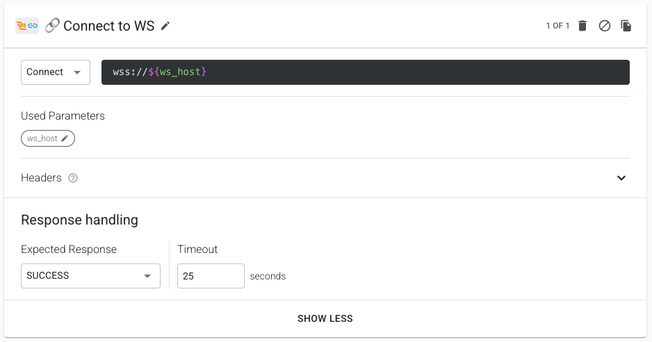
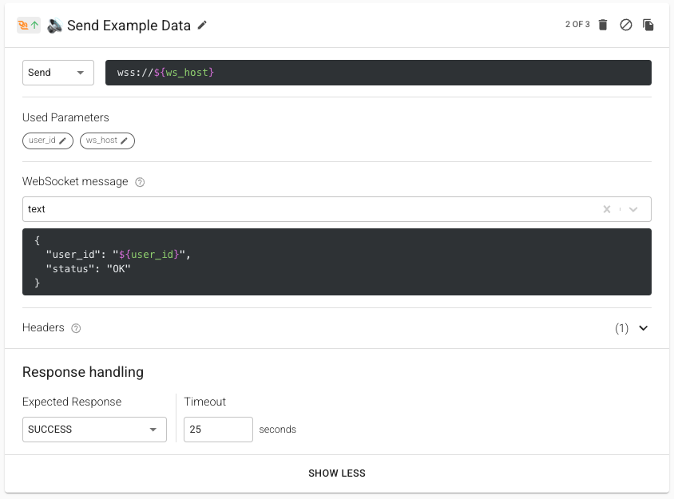
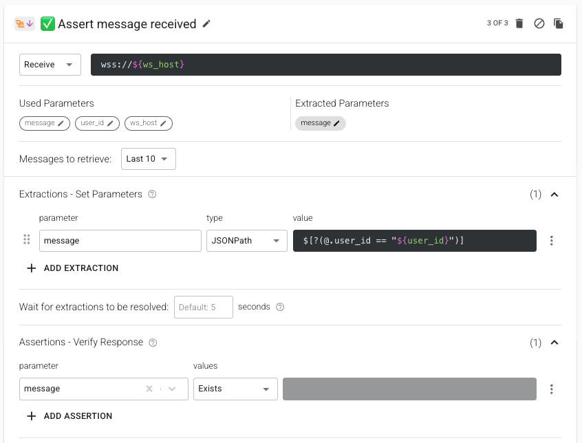
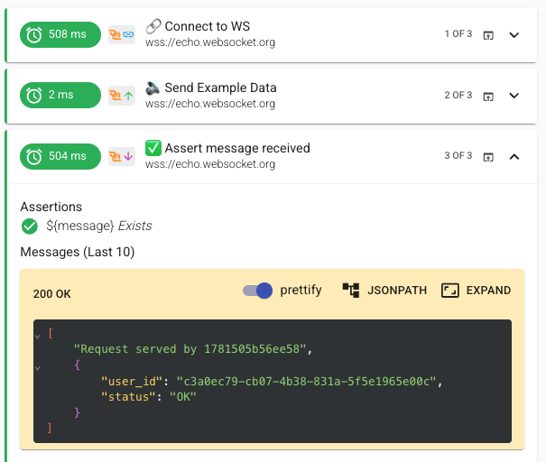

# Web Socket step

The WebSocket step enables real-time, bidirectional communication testing by allowing you to connect to WebSocket endpoints, send messages, and validate responses. This step is particularly useful for testing applications that require persistent connections and real-time data exchange.

## WebSocket Step Operations

A WebSocket step can perform three main operations:

1. **Connect** - Establishes a WebSocket connection to the specified endpoint
2. **Send** - Transmits messages through an established WebSocket connection
3. **Receive** - Listens for and validates incoming WebSocket messages

## Step Configuration

### Connection

When establishing a connection:
* The URL format follows: `wss://<your-websocket-endpoint>`
* Headers can be added to the WebSocket handshake request for authentication or custom protocols
* A timeout value (in seconds) can be set for the connection attempt

### Sending Messages

For sending messages:
* Supports two data types:
  * Text (JSON, plain text)
  * Binary data
* Messages can include dynamic parameters
* Headers can be included with the message
* Used for both sending data and subscribing to channels
* A timeout can be specified for the send operation

Note: A Send step without a preceding Connect step will automatically create a new WebSocket connection.

### Receiving Messages

When receiving messages:
* Messages are fetched based on the **WebSocket URL**
  * Use URL query parameters (e.g., `wss://example.com/ws?userId=1`) to send and filter messages by specific properties
* **Message retrieval options**:
  * Last - Returns the most recent single message
  * Last 10 - Returns an array of the last 10 messages
  * Last 50 - Returns an array of the last 50 messages
* **Extractions** support all standard Loadmill extraction methods
  * Example JSONPath for array filtering: `$[?(@.id == "${my_id}")]`
  * [Learn more about extractions](https://docs.loadmill.com/api-testing/test-suite-editor/set-parameters-extractions)
* **Wait for extractions to be resolved** - Since WebSocket connections are asynchronous, this setting defines how long to wait for messages that match your extraction criteria. Default is 5 seconds, but you may need to adjust this based on your application's behavior.
* **Assertions** - Use the same powerful assertion capabilities as HTTP requests to validate your WebSocket messages, including JSON/XML validation, value comparisons, and regex matching. [Learn more about assertions](https://docs.loadmill.com/api-testing/test-suite-editor/assertions)
* The **Flow Control** section allows to repeat the request until the parameter's value meets the requirement or number of iteration reached.

## Example Run

Let's look at a simple WebSocket test flow in action:

This example demonstrates a complete WebSocket interaction:

#### 1. Connect to WebSocket:
* Establishes connection to a WebSocket server

#### 2. Send Some Data:
* Sends a message on the connection

#### 3. Assert message received:
* Waits for all extractions to be resolved
* Once resolved, validates that the extracted `${message}` exists
* Received messages are displayed for easy debugging
