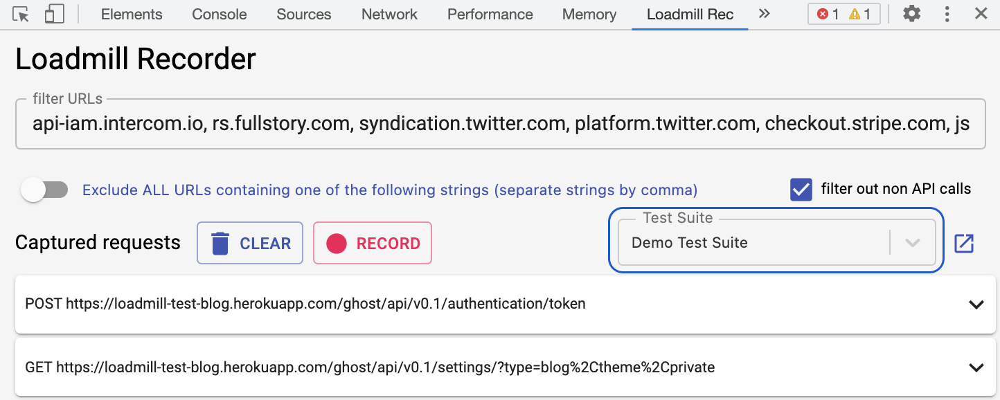
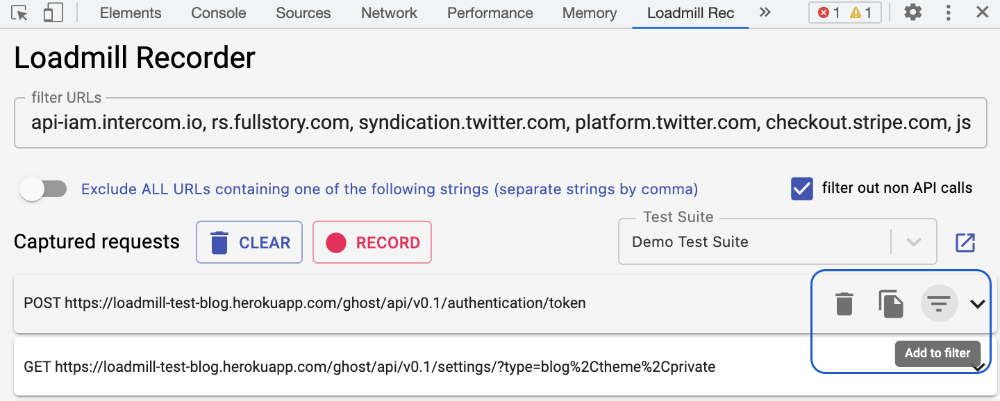

# 🎥 Recordings

Loadmill users can easily record real user sessions as Loadmill test flows, then integrate the flows into their Continuous Delivery pipeline and run them per each code-change.

Loadmill provides two main options to record real user sessions: **Loadmill Chrome recorder extension** and **Loadmill node recorder**.

## Loadmill Chrome recorder extension

1. Download the extension [here](https://chrome.google.com/webstore/detail/loadmill-recorder/gdkmnfehipofdefhpegbgkkocinlaofd?hl=en).
2. Go to [API Tests](https://www.loadmill.com/app/api-tests/test-suites) in Loadmill and create a Test Suite.
3. Open the Chrome Developer Tools => switch to the **Loadmill Rec** tab and select name of the created Test Suite in the extension.


:brain: If you are not logged in to Loadmill, you will be prompted to the login page. Please note that sometimes other installed extensions like Adblock may cause issues, thus we recommend switching them off while recording.


4\. Click on the "Clear" button within the extension to clear the captured requests list and navigate to the tested website.

5\. Start recording your test. There are several filtering options: you can filter irrelevant domains by clicking on the "Add to filter" icon. That will automatically remove the domain requests and won't include them in future recordings. You can also delete single requests by clicking on the "Delete" icon.

Note, you can also configure URL Filters within [the Recordings Settings](https://docs.loadmill.com/working-with-the-recorder/recorder-settings#url-filters) so that the entire team will have the same filters.

6\. To make sure your recorded session includes only relevant requests, you can click on the expanding arrow within requests to see their request and response body.

7\. When you are done recording your session, click the "Upload" button at the bottom. 

8\. Click on the small box next to the Test Suite name to open the recorded test in your Test Suite.


:mage: For each test flow Loadmill automatically creates [**extractions**](https://docs.loadmill.com/api-testing/test-suite-editor/set-parameters-extractions)\*\* **and** \*\*[**assertions**](https://docs.loadmill.com/api-testing/test-suite-editor/assertions):

1. Default assertions - for any extraction we find in the recorded test, we add a default assertion to it (example: "id" exists).
2. Specific assertions - for any parameter with given user key (for example, "success") we extract it and assign to it an assertion (example: "success" equals "true").


9\. Run the Test Suite by pressing the "RUN SUITE" button and see [your results](https://docs.loadmill.com/api-testing/analyzing-an-api-test-results). 🥳 

## Loadmill node recorder

We've developed **a smart recorder** that allows users to capture traffic in the QA or Production environment and replay it as API tests.

.png>)

1. Create a new recording from the [Recordings tab in Loadmill.](https://www.loadmill.com/app/recordings/my-recordings)
2. Play your test scenarios in the recorded app. By default, the traffic is split to different sessions by its source (different IPs) and intermissions between user actions. (If you wish to manually split a recorded session in your test environment, use the [Loadmill session splitter](https://chrome.google.com/webstore/detail/loadmill-session-splitter/beknfelcpakgnojjfcdpjddhnckekhni), else you can use our [advanced Recordings settings](https://docs.loadmill.com/working-with-the-recorder/recorder-settings))
3. When you're ready, stop the recording and [generate a Test Suite from it](https://docs.loadmill.com/working-with-the-recorder/working-with-the-recorder).

See how to set the recorder up in [the next guide](https://docs.loadmill.com/working-with-the-recorder/setting-up-the-recorder).

## Support

We are always here if you need any help! Click on the bubble chat button in the lower-right corner of the screen or drop us a line at [support@loadmill.com](mailto:support@loadmill.com).
