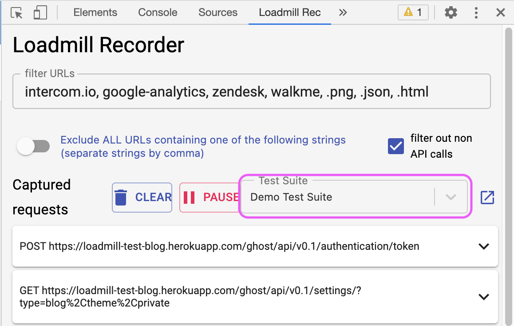
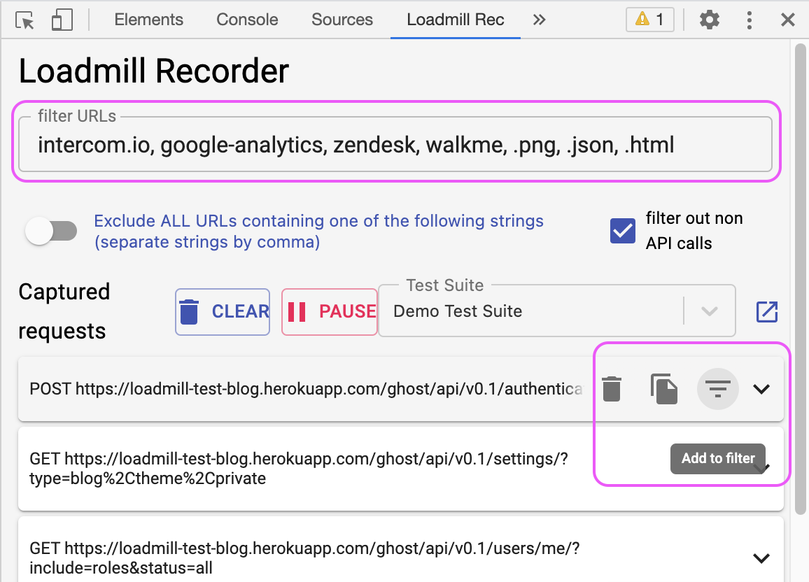

# Loadmill Chrome recorder extension

Loadmill users can easily record real user sessions as Loadmill test flows by using our Chrome recorder extension. Then integrate the flows into their Continuous Delivery pipeline and run them per each code-change. 

## How it works

1. Download the extension [here](https://chrome.google.com/webstore/detail/loadmill-recorder/gdkmnfehipofdefhpegbgkkocinlaofd?hl=en).
2. Navigate to API Tests in Loadmill and create a [Test Suite](https://docs.loadmill.com/api-testing/test-suite-editor) that will hold recorded test flows.
3. Open the Chrome Developer Tools, switch to the Loadmill Rec tab and select name of the created Test Suite in the extension. 


🧠 If you are not logged in to Loadmill, you will be prompted to the login page. Please note that sometimes other installed extensions like Adblock may cause issues, thus we recommend switching them off while recording.


   4. Click on the "Clear" button within the extension to clear the captured requests list and navigate to the tested website. 

   5. There are several filtering options: you can delete irrelevant requests by clicking on the "Delete" icon or remove irrelevant domains by clicking on the "Add to filter" icon thus all future recordings will disregard requests from these domains.

Note you can also configure URL Filters within [the Recordings Settings](https://docs.loadmill.com/working-with-the-recorder/recorder-settings#url-filters) so that the entire team will have the same filters. 

    6. To make sure your recorded session includes only relevant requests, you can click on the expanding arrow within request to see its request and response body.

    7. When you are done recording your session, click the "Upload" button at the bottom.     

    8. Click on the small box next to the Test Suite name to open the recorded test in your Test Suite. 


🧙 For each test flow Loadmill automatically creates [**extractions**](https://docs.loadmill.com/api-testing/test-suite-editor/set-parameters-extractions) ****and ****[**assertions**](https://docs.loadmill.com/api-testing/test-suite-editor/assertions):

1. Default assertions - for any extraction we find in the recorded test, we add a default assertion to it \(example: "id" exists\).
2. Specific assertions - for any parameter with given user key \(for example, "success"\) we extract it and assign to it an assertion \(example: "success" equals "true"\).


     9. Run the Test Suite by pressing the "RUN SUITE" button and see [your results](https://docs.loadmill.com/api-testing/analyzing-an-api-test-results). 

### Support

We are always here if you need any help! Click on the bubble chat button in the lower-right corner of the screen or drop us a line at [support@loadmill.com](mailto:support@loadmill.com).  

