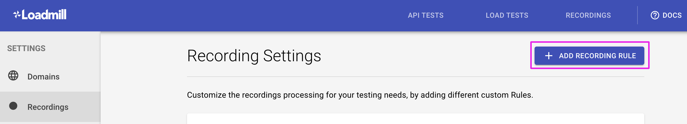
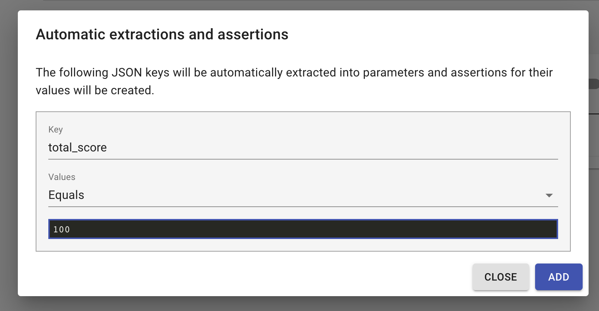
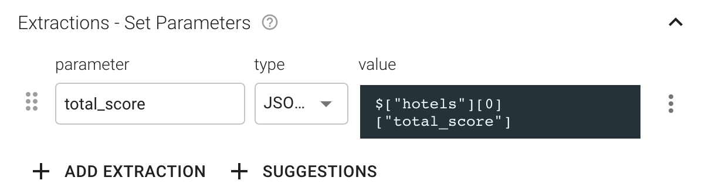
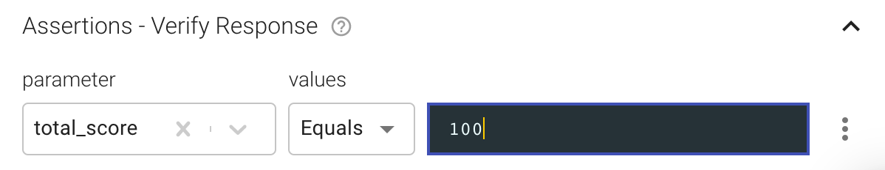

# Recording settings

Use the advanced Recording Settings to create meaningful replay-able tests that are easy to configure. Team Admins can control these settings [on this page](https://www.loadmill.com/app/user/settings/recordings). 


**Reduce Global Parameters** is the only setting enabled by default that makes sure only relevant parameters will be created during the recording import.

👇 These are recording rules you can add & configure for our [Chrome recorder extension](https://docs.loadmill.com/working-with-the-recorder#loadmill-chrome-recorder-extension) & [recorder](https://docs.loadmill.com/working-with-the-recorder#loadmill-node-recorder). 


### Split sessions by URLs \(for the [Recorder](https://docs.loadmill.com/working-with-the-recorder#loadmill-node-recorder) use only\)

In general we want the test cases created based on recorded data, to be short and focused as possible. By default, Loadmill will split a recorded user session into two separate Loadmill test flow, if the user hasn't been active for 5 minutes. 

In many cases, you will want to control when a session is split into separate test cases. Using this setting, you can add API URLs that will define the beginning of a new test case each time they are called.


🧠 **Note:** You can also use raw JavaScript to fire an event from your code to splits a recorded session:`navigator.serviceWorker.controller.postMessage({ type: "reset-session" });`


### URL Filters

Use this setting to filter API calls that are not relevant for your tests i.e. marketing, monitoring, analytics and other external integrations.

### Special Keys

Use this setting to manage important Special Keys located in your POST requests body. This way, we can make sure they won’t be missed during the recording processing phase.

### Entities Synonyms

Entities Synonyms help us detect same entities with different names like a 'Jet' and an 'Airplane'.

Here you can add and manage entities synonyms. This way, we can make sure they won’t be missed during the recording processing phase. Synonyms must be entered in a list and separated by commas. i.e. Plane, Aircraft, Jet.

### Ignored Keys

Ignored keys are a list of keys that will be ignored while generating tests from recordings.  
Keys in this list will never be extracted to a parameter in the created tests.

### Default values

Default values are a list of keys that once detected will be assigned with a default value. This value may be overridden on runtime.

### Non-Secret Keys \(for the [Recorder](https://docs.loadmill.com/working-with-the-recorder#loadmill-node-recorder) use only\)

Non-secret keys will be used to identify and record values even when recording in secure mode.  
Keys and paths to identify non-secret values are given in a JSONPath-like syntax.


\*\*\*\*🧠 **Note** : Do not record private user data. It is recommended to test these keys locally before recording real users.


### Regex replacers

Regex replacers will be used to identify any strings that match the regex and extract them as a parameter.

### Strict Response Validation

When enabled, this option will add JSON Schema assertion to every recorded JSON response.

### Automatic extractions and assertions

Configure which JSON keys should be extracted into parameters and which assertions should be created for them. For example, I've recorded a test flow that includes the "total\_score" JSON key and it should be equal to 100 at the beginning of the test flow, so I can add an automatic extraction and assertion for it:

Thus, when uploading a recording, Loadmill will automatically create the extraction and assertion in the test flow in case there is such a JSON key.

