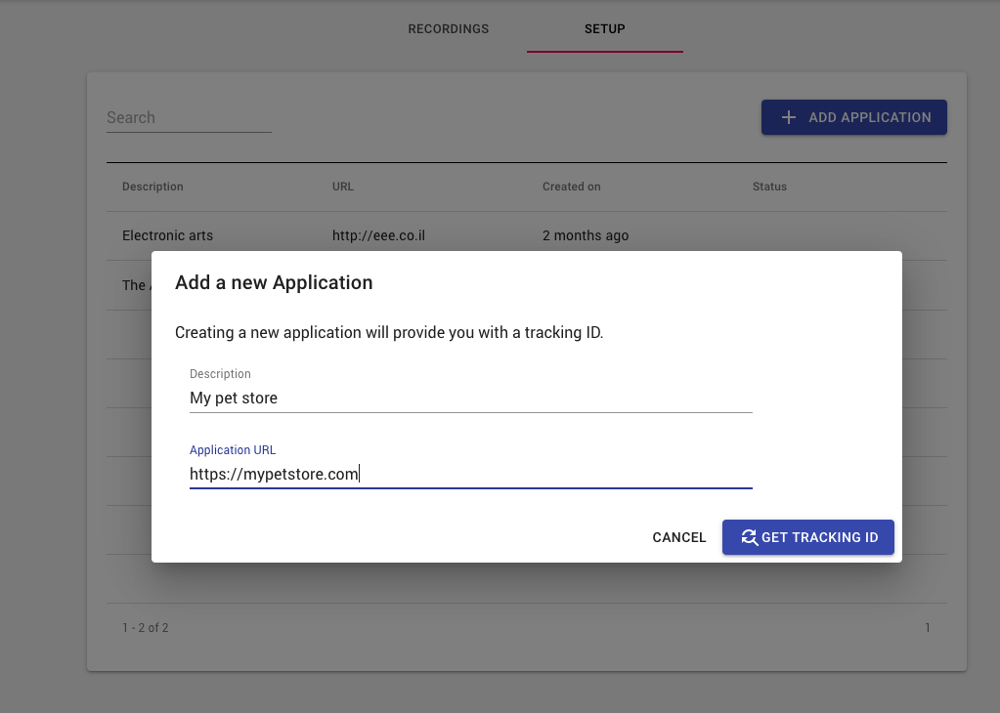
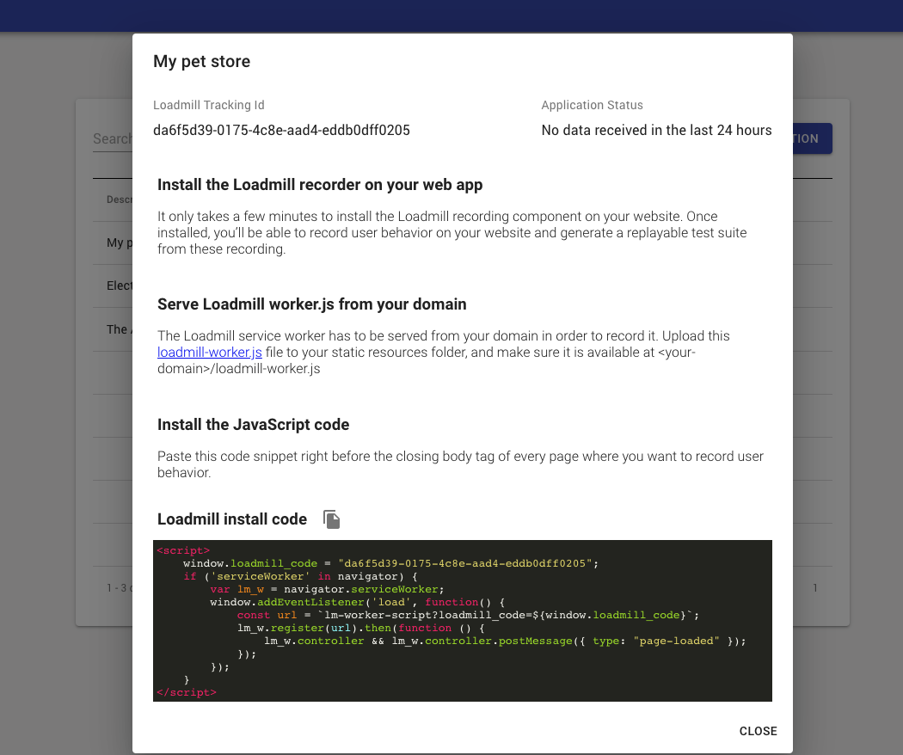
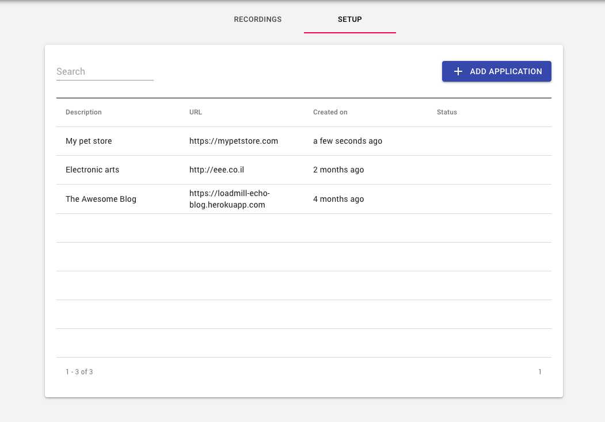

# Setting up the Recorder

## Create an Application 

Before you'll start recording users flows, you'll need to set up an application to record from:

1. Go to "Recordings" tab, located in the main navigation area, and click on the "Setup" tab.
2. In the "Setup" tab, click on + "ADD APPLICATION" button.
3. Name the application in the description and fill in its URL.
4. Click on "GET TRACKING ID" button.
5. In the Application dialog, setup the following: 

1. **Serve Loadmill worker.js from your domain:**  The Loadmill service worker has to be served from your domain in order to record it. Upload this [loadmill-worker.js](https://echo.loadmill.com/loadmill-worker.js) file to your static resources folder, and make sure it is available at &lt;your-domain&gt;/loadmill-worker.js 
2. **Install the JavaScript code:**

   Paste the code snippet right before the closing body tag of every page where you want to record user behavior.  

3. Right after your'e done - the application will appear in the applications table.

## 

