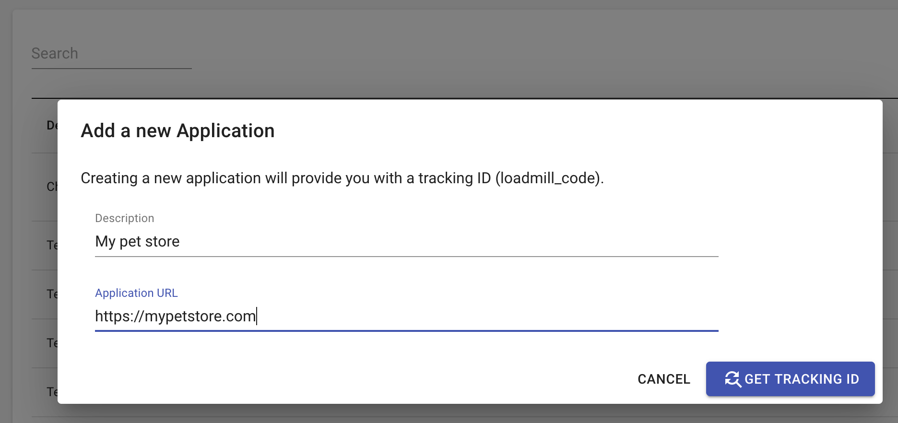
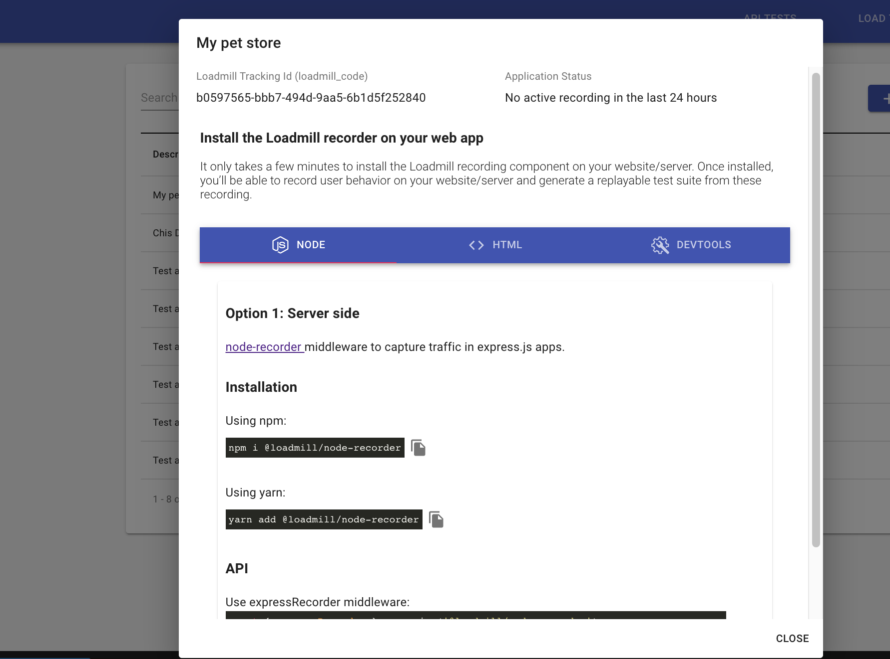
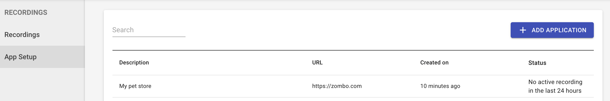

# Setup

## Create an Application 

Before you'll start recording users flows, you'll need to set up an application to record from:

1. Go to the **Recordings** tab, located in the main navigation area, and click on the **App Setup** tab.
2. In the "Setup" tab, click on + "ADD APPLICATION" button.
3. Name the application in the description and fill in its URL.

  4\. Click on "GET TRACKING ID" button.

  5\. There are three options how to install the recorder:

* Option 1: [Server side](https://www.npmjs.com/package/@loadmill/node-recorder) aka Node
* Option 2: Client side aka HTML
* Option 3: Testing in Developer Tools aka DEVTOOLS

Choose a relevant option for you and right after you've installed the recorder - the application will appear in the applications table.

##
