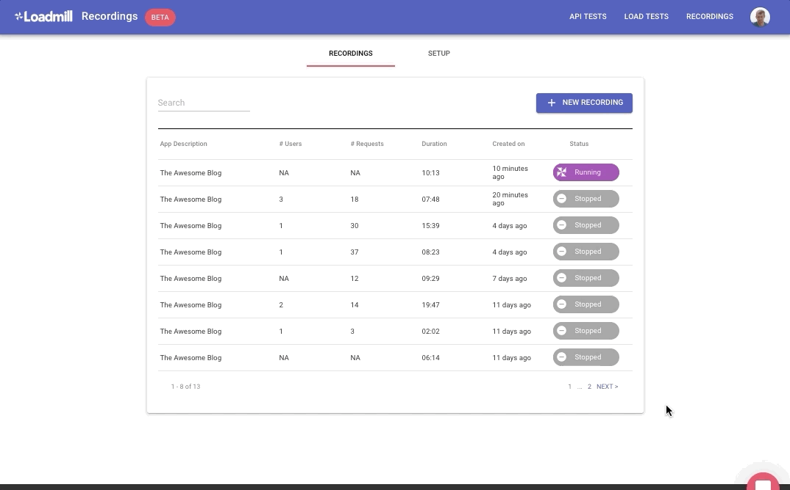

# Working with the Recorder

## Start Recording 

After you're all set with your application, it's time to start recording your users session:

1. Go to the "Recordings" tab and click on + NEW RECORDING.
2. In the dialog, select the wanted application from the list.
3. Click START RECORDINGS.
4. Once the recording starts, you'll be able to see its progress in the recordings table.
5. Click on the running recording in order to review its progress.
6. In order to stop a recording, click on the STOP button.

## Awesome! I've recorded my application, now what?

When you end the recording process, you can review its list of tracked API's \(method, path, Avg response time & Throughput\).

The next step will be Generating those flows into a repayable Test Suite:

Click "GENERATE TEST SUITE".

