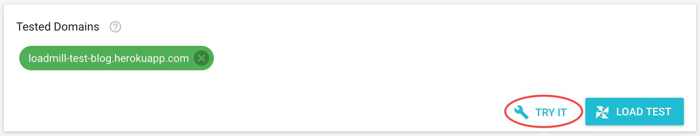
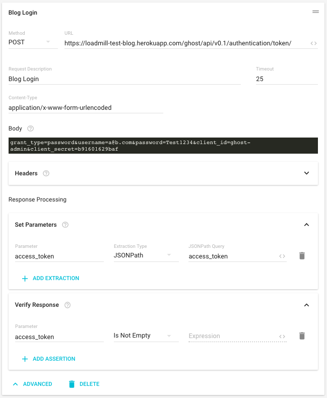

# Working With The Test Editor

## Starting From Scratch

* Create a new empty test by opening the side menu and clicking “New Test” \(If you just signed-up you might be already in the new test page\)
* Give your new test a short description `My First Test`
* Set the value of the URL for Request \#1 to be - `https://loadmill-test-blog.herokuapp.com`. This is a ghost blogging server we are using for testing and demos, so can use it for your test. You might see the tested domain showing up in a _red_ chip at the bottom of the page, this is OK for now \(This is because we haven't proved ownership of this tested domain yet, we can fix that later\)
* Let’s run a trial run to make sure that our test scenario is configured correctly. Click the “TRY IT” button at the bottom of the page, this will open the “TRY IT” dialog. Make sure the first option \(Run Remotely\) is selected and click the “RUN” button.



* Wait for the trial run to finish successfully and click Request \#1 to expand it and view its response \(There should be no errors\).
* Now that we know that our scenario is configured correctly we can run it as a load test with multiple users. Click the “LOAD TEST” button to open the “Run a load test” dialog. Set the test duration to 2 minutes and the number of maximum test users to 5 and click the “RUN” button. \(note: Until you have verified ownership over all the tested domains included in the test scenario you won’t be able to run a load test with more than 5 concurrent users\)
* You are now running your first load test, it simulates 5 concurrent users loading our blog homepage by sending HTTP GET requests to `https://loadmill-test-blog.herokuapp.com` repeatedly. Hover your mouse over the graph to inspect average performance over time.

## Using parameters and extracting response values

* In our first simple test we have simulated users loading the homepage our blog, our second test is going to simulate several users publishing new entries to the blog.
* First create a new empty test.
* Only logged in users can post to our blog, so let's start by executing a login request and store the authentication token returned by it into a parameter for later use.

  * Set the Request \#1 method to `POST` and its URL to - `https://loadmill-test-blog.herokuapp.com/ghost/api/v0.1/authentication/token/`
  * Click the ‘ADVANCED’ button to expand the advanced section of the request
  * Update the request description to `Blog Login`
  * Set the Content-Type to `application/x-www-form-urlencoded` \(last in the list\).
  * And paste this as the request body - `grant_type=password&username=a@b.com&password=Test1234&client_id=ghost-admin&client_secret=b91601629baf`
  * Expand the “Set Parameters” card and set a value to a parameter named `access_token` using a `JSONPath` extractor querying for `access_token`. This will create a value extractor that will execute a [JSONPath query](http://goessner.net/articles/JsonPath/) against the JSON response of the request and extract the authentication token into a parameter named `access_token`.
  * Verify that a value was set to the parameter `access_token` by the `JSONPath` extractor by expanding the ‘Verify Response’ card of the request and creating an assertion. Add an assertion that states that the `access_token` parameter `Is True` \(In Js non-empty strings are considered "truthy" values\).

  

  * Click the “TRY IT” and execute a trial run to make sure it is working.

* Now that we have the authentication token stored in `access_token` we can use it to publish on our blog
  * Create a new request by clicking the "+ ADD REQUEST" button below the first request.
  * Set it as a `POST` request to `https://loadmill-test-blog.herokuapp.com/ghost/api/v0.1/posts/`
  * Expand the advance section and set its description to `Publish Blog Post`
  * Set the Content-Type to `application/json` and the body to this JSON-

    ```javascript
    {
       "posts": [
          {
             "title": "Title ${__random_chars}",
             "slug": "${__random_chars}",
             "markdown": "Text ${__random_chars}",
             "status": "published"
          }
       ]
    }
    ```

  * This JSON body defines the blog post that we are going to publish. Notice that we have used one of Loadmill's built-in parameters to make it a little more interesting - `${__random_chars}`. The `__random_chars` parameter will change to a 10 random characters during test/trial execution.
  * Now, lets use the `access_token` parameter value we extracted from the login response to authenticate this request. Expand the header card of publish request and add a header with the name `Authorization` and the value `Bearer ${access_token}`
  * Run a trial of the whole scenario and go to `https://loadmill-test-blog.herokuapp.com/` to see that our blog posts are getting published.
* Now that we know that our full scenario is working we can run it as a load test. Click the "LOAD TEST" button at the bottom of the test and run the test 🎉

